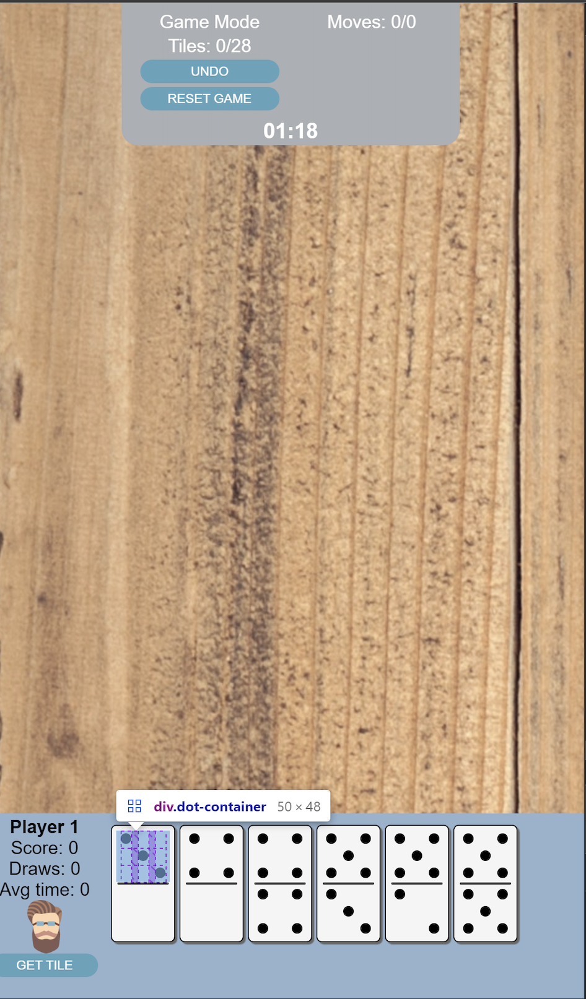

# Dominoes ReactJS
### Students
- `Sharon Brizinov`
- `Roie Koper`

### Demo

### Game Mechanics
- `Game` is where the main logic of the game takes place. This component controls all the players, the board, the bank with all tiles, and the drop logic of each dominoe tile on the board. In essence, the Game component will manage the entire application.
    - `isLegalDrop` function will decide whether a tile can be placed in a certain location on the board.
    - `render` function will manipulate the DOM and evetually will place all the HTML elements in the DOM.
    - `isPlayerCanPlay` function decides whether a certain player can make a legal move. As long as there is a player that can play (make a legal move) and the tile bakn isn't empty, the game continues. All those checks take place in the `checkGameEnded` method.
- `Board` compnent manges the board and the tiles that are being placed on the board.
- `Tile` component holds two `DotContainer` which are a simple way to represent the two parts of a single Dominoe tile. Each `DotContainer` is responsible to draw the relevant part of the domino - which means draw the required number of black dots.
- `Popup` is a simple coponent to present notifcations/alerts to the user.
- `GameDetails` is a simple component to present some game statistics to the user regarding the entire game (and not just for a single user).
- `Player` component renders the relevant data for each player including the "hand" deck, statistics regarding the player, etc.
    
### Completed Bonuses
1. Animations.
2. Undo.

### How to run the project
1. Run `npm install` command to load all npm modules.
2. Run `npm run build` to pack all the modules into a single file.
3. Go to the new `public` directory and run `index.html` in the browser.